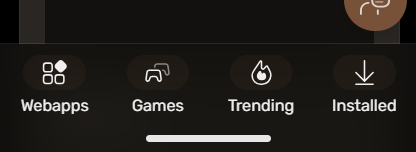
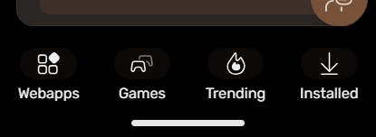
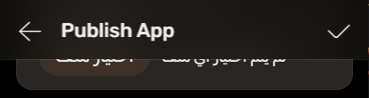

# OrchidOS - Developer Build v146

This is a continuation of Build v145

## OrchidUI
- Updated Audio Icon

## OrchidJS
- Removed Layout Support Of The Terribly-Revived Already Obsolete And Mostly Overpriced "Smart" Featurephones That Pretty Much Don't Do Jack Shit Right And Cost as Much as a Cheap Smartphone. Sometimes More (Not Recommended Dosen't Even Begin To Describe This Lazy E-Waste Revival)
  - KaiOS "Smart" Featurephones


## System
- Added Time & Date To Notification Tray Header
- Added Dark Mode Tray Toggle
- Added Expand Icons To Indicate Tray Buttons Being Expandable To a Menu
- Added Carrier Label
- Added Landscape Orientation Support
-

## Vividus 2D
- Added Partial Support For Window Resizing

# OrchidOS - Developer Build v145

Prepare because this is one hell of a changelog for OrchidOS

NOTICE: This build is not shared CSS backward compatible with existing webapps

## Source Code
- Moved `shared` From `<project>/apps/shared` To `<project>/shared`

## Browser
- Updated User Agent Product Name From `OrchidBrowser/<version>` To `OrchidChr/<version>`

## OrchidUI
- Added Bold Text Support
- Added Contrast Text Support
- Added Text Scaling Support
- Improved Reveal Animations
- Updated Variables
- CSS Has Been Reorganized
  - 'common' - Contains Usual Gaia-like Stylesheets
  - 'app' - Contains App Specific Stylesheets

## OrchidJS
- APIs Started The Process Of Migrating To OrchidJS To Be Browser Independent
- Reopening a Previously Scrolled Panel Will Now Scroll It To The Top If It's Not The Root Panel
- Added Byte To Size Unit Conversion
- Moved All App Setting Handlers To OrchidJS Off Preload
- Added a Early Work-in-progress Version Of Vividus 2D
- Dropped The Use Of idiotwu's Smooth Scrollbar
- Apps Are Now Classed Based On Platform
  - `windows-app`
  - `osx-app`
  - `linux-app`
  - `webapp` - Fallback For Unknown Platforms
- Apps Now Get The `active` Class When In Focus
- Apps Now Get The `maximized` Class When Maximized Whilst Running Directly In Simulator Webview
- Added Panel Tabs Translucency Similar to Panel Header Translucency
  - Panel Tabs Translucency
  
  - Panel Tabs Translucency (Scrolled)
  
  - Panel Header Translucency
  
  - Panel Header Translucency (Scrolled)
  
- Added HTML Elements
  - `orchid-account-banner` - Account Profile Banner. Example Of How To Use:
    ```html
    [...]
    <section class="lists">
      [...]
      <orchid-account-banner></orchid-account-banner>
      [...]
    </section>
    [...]
    ```
  - `orchid-account-button` - Header Avatar-style Account Button. Example Of How To Use:
    ```html
    <header>
      [...]
      <menu role="toolbar">
        <orchid-account-button></orchid-account-button>
      </menu>
    </header>
    [...]
    ```
  - `orchid-tabs` - Quick Easy Tabs. Example Of How To Use:
    ```html
    [...]
    <section>
      [...]
      <orchid-tabs>
        <orchid-tab id="tab1">Tab 1</orchid-tab>
        <orchid-tab id="tab2">Tab 2</orchid-tab>
        [...]
      </orchid-tabs>
      [...]
    </section>
    [...]
    ```
  - `orchid-tab` - Tab for `orchid-tabs`
- Added `notify(title: string, options: Record<string, any>)` function to invoke OrchidOS notifications directly (Recommended For OrchidJS App Notifications)

## System
- Optimized Performance
- Partially Migrated To OrchidJS
- Partially Unified The Code
- Added Integrated Simulator Window
- Fixed Low Specification Device Statusbar Being White in Bright Theme Colors
- Title Tooltip Design Updated
- Utility Tray Updated
  - Added Large Clock
  - Added Carrier Name
  - Updated Color Scheme
  - Updated Theme Variables
  - Migrated To OrchidJS Force Touch Hold To Expand
  - Added Cast Button (Unfunctional For Now)
  - Removed Devices Section
  - Optimized Gestures
  - Moved Date Alongside The Large Clock
- Fixed Desktop Window Resizing Bugs
- Added a Simulator Beta Badge To Indicate System Is Unfinished

## Default Theme
- Updated Colors To OLED-Friendly Color Scheme
- Updated Variable Names
- Added Variables For Customizing List Borders
- Added Variables For Customizing Radiuses

## Homescreen
- Icons Now Scale Based on Viewport/Screen Size
- Optimized Icon Resolution Picker
- Fixed App Closing Animation Icon Alignment

## Settings
- Added 12/24 Hour Clock Option
- Added Bold Text Mode
- Added Contrast Text Mode
- Added Text Scaling
- Added Visible Battery Percentage Option
- Added Storage Categories
- Added Avatar Icon To Header
- Updated Wallpaper Preview
- Updated Account User Profile
- Added Golden Verification Which Only The Owner (MortCodesWeb) Has. It's Meant To Avoid Owner Impersonation From Verified Users
- Regular Verification Is Now Blue
- Added a Default Banner
- Added a Work-in-progress Change Ringtones Panel
- Added a Work-in-progress Change Notification Sound Panel
- Storage Bar Height Shrunk Down

## Articles
- Updated Account User Profile
- Added Golden Verification Which Only The Owner (MortCodesWeb) Has. It's Meant To Avoid Owner Impersonation From Verified Users
- Regular Verification Is Now Blue
- Added a Default Banner
- Added URL Paramater Support
- Added Reply Posts
- Added User Profile Panels
- Added Tabs For Mobile
- Added Beta Badge To Indicate Product Is Unfinished
- Clicking Avatar Or Username Now Opens The Post Publisher's User Profile
- Migrated To OrchidJS

## Messages
- Added Beta Badge To Indicate Product Is Unfinished
- Migrated To OrchidJS

## Store
- Added Beta Badge To Indicate Product Is Unfinished
- Migrated To OrchidJS

## Music
- Migrated To OrchidJS

## Video
- Added a Proper Base UI
- Migrated To OrchidJS

## Gallery
- Migrated To OrchidJS

## Keyboard
- Migrated To OrchidJS

## Camera
- Updated UI And Redesigned Toolbars
- Added a Shutter Animation
- Migrated To OrchidJS
